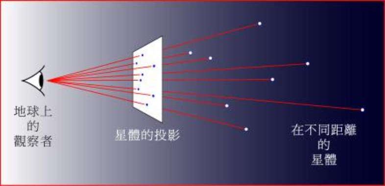
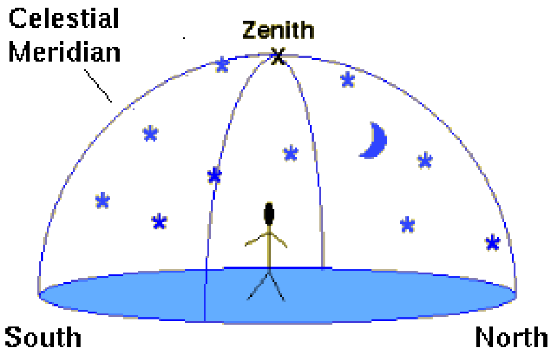
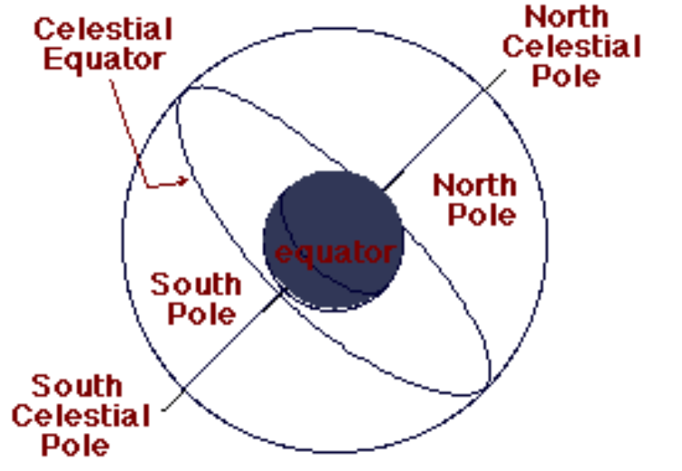
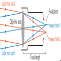
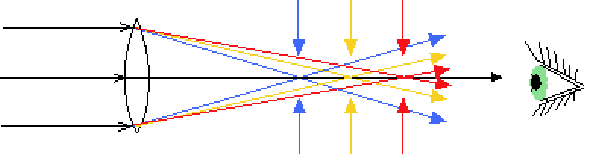
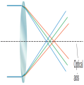
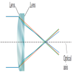
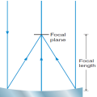
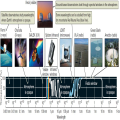

# 天文学导论

---

> *表示不考试

<h2 text-align="center">天文学导论①：天文学基础</h2>

## 天体的视运动

> 对应教材：
>
> - Chapter 2: Patterns in the Sky - Motions of Earth
> - APPENDIX 5: Nearest and Brightest Stars
> - APPENDIX 6: Observing the Sky

### 星座与星图

星座
- 古代：组成可辨认图案的一群恒星
- 现代：全天 88 个星座
  - 1929年，国际天文学联合会（IAU）正式把全天划分为 88 个星座，并清楚界定每一个星座的边界，现代星座是指**一块一块的天区**

星座只是天上一个一个的区域（天区）
- 星座并不表示每个星座中的星星之间存在一定的内在联系。例如，星座不等价于以引力而被束缚的一个系统
- （古代）星座仅代表本天区中较亮的星

星图上的一颗星可能是：
- 双星
- 聚星
- 星团
- ……（当然也可以是单星）

最亮的恒星：
1. 太阳
2. 天狼星（并非除太阳外最近的恒星）
3. 老人星
4. 南门二星其一（南门二星距离次于太阳）
5. 南门二星其二

夏季大三角：织女星、牛郎星、天津四

### 地球的自转：天体的周日视运动

头顶的星空取决于观测者在地球表面上的**纬度**和当地时间（**经度**）

#### 天顶、子午线与地平面

- 组成一个固定不变的关系（**地平坐标系**）
  - 天顶总是与地平面成 **90** 度角
  - 子午线平分**半个天球**

中天
- 某星的位置相对于天顶、地平面和子午线在**变**，这不是
由于星星的位置在变，而是由于
  - 天球在转动
  - 观测者在地球上移动

> 任何<u>通过**子午线**</u>的天体都处于其距观测者地平面的最高位置，称为**过中天**

把天空幻想为一个大水晶球--天球，包括“太阳、月亮”在内的所有星星都“镶嵌”其上，而地球则孤悬于天球的中心

- 在一天之中，是否能“看遍”整个天球，取决于观测者所在的地理纬度
- 经度：某部分天球位于地平面（子午线或特定方位）上的时刻

### 地球的公转：天体的周年视运动

### *天球坐标系：恒星时

### 地球自转轴的进动：岁差

### 月球视运动与月相

### 日月食

## 天体的运动

> aks: 天文学发展史

### *古希腊的地球中心说

地心说的基本模型：

- 地球为宇宙的静止中心
- 同心球层，匀速圆周运动
- 天体完美无瑕

行星的**视逆行**难题

相对于背景恒星，行星会（需数月观测）：

- 顺行：向东
- 逆向：向西
- 逆行时行星变亮

> 地心说的基本模型不能解释**行星的逆行及亮度变化**

本轮对逆行疑难的解释

- 行星不是固定在同心球层（**均论**）上，而是固定在**本轮**上，但本轮中心固定在同心球层上

地球不在正中心，且行星通常需要很多均轮来解释，本轮中心和本轮（行星）沿同一方向作匀速圆周运动

托勒密于公元 150 年在长达 13 卷名为《天文学大成》的巨著中发表了最高级别的地球中心说，这个模型所预言的行星位置和实际位置的误差在“可接受的数度之内”，主导西方思想约 1500 年

// TODO

### 现代天文学的诞生

#### 哥白尼的太阳中心学说

对行星逆行的解释

- 逆行：小轨道行星（地球）比大轨道行星（火星）绕日公转得更快，地球“追上并超越”火星
- 亮度变化：行星到地球的距离在变化

哥白尼革命：

- 对于托勒密“地心说”的 3 个错误观点，哥白尼：
  - 挑战了 1
  - 但没有挑战 2（也需要本轮）
  - 且隐含了 3
- 地心说是教会根深蒂固的教条 + 日心说预测行星运动的“准确性”和地心说不相上下，因此日心说并不被接受

#### 第谷·布拉赫的杰出观测

在望远镜之前，做出了最好的天文仪器和最精确的天文观测

第谷的主要天文贡献

- 对行星（特别是火星）的观测为开普勒建立正确的太阳系模型提供了至关重要的数据
- 1572 年，发现了一颗 la 型超新星，现为第谷超新星遗迹
- ……

#### 开普勒行星运动三定律

开普勒第一定律：轨道形状

行星以**椭圆轨道**环绕“太阳”运行，太阳（近似）位于椭圆的一个焦点上，（太阳系）行星轨道近似圆轨道

开普勒第二定律：行星速度

行星和太阳的（假象）连线在相等的时间内扫过相等的面积 -> 行星越接近太阳则速度越快

开普勒第三定律：轨道周期与到日距离

行星公转周期的平方和其到太阳的平均距离（椭圆轨道半长轴）的立方成正比

$$
(公转周期)^2=(常数)\times(半长轴)^3
$$

#### 伽利略：现代天文学的诞生

- 意大利天文学家与（实验）物理学家
- **发现支持哥白尼学说的关键观测证据**
- 奠定正确理解物体在地球表面运动的动力学（惯性）和引力的基础

伽利略与望远镜

- 望远镜不是伽利略发明的，荷兰商人发明了望远镜
- 伽利略是第一位（1609 年）使用望远镜观测星空的人，首次利用仪器增强人类的天文观测能力，**彻底否定地心说**

伽利略的主要天文发现
- 月球表面不光滑，有众多陨击坑（环形山）
- 太阳黑子，且运动 -> 太阳自转
- 银河：大量恒星
- 绕木星旋转的 4 颗卫星（伽利略卫星）

金星越亮，看起来越小（远），**彻底证明**哥白尼太阳中心学说是正确的！

### 牛顿的万有引力定律

牛顿三定律

1. 惯性定律
2. **F = ma**
3. 作用力与反作用力

潮汐

- 月球对地球近端的引力是其对远端引力的 1.07 倍
- 一个天体上潮汐现象是其他天体对其不同部位的引力作用差异的结果

### 爱因斯坦的相对论

## 电磁辐射

## 天文望远镜

> 对应的教材：
>
> - Chapter 6: The Tools of the Astronomer

### 光学望远镜

- 折射式望远镜
  - 原理：光的折射
  - 世界最大的折射望远镜：美国叶凯士天文台
  - 缺点：色差
    - 透镜（棱镜）：蓝光比红光偏折大 -> 蓝光焦距短于红光焦距
    - 单一透镜形成彩虹图像
  - 解决方案
    - 长焦距：减小色差
    - 复合透镜：补偿色差

- 反射式望远镜
  - 原理：光的反射
  - 缺点：球面像差
    - 球面的镜面（直径大于约1米）不能把平行光聚焦于单一焦点
  - 解决方案
    - 采用抛物面的镜面，可得单一焦点

光学望远镜的类型
- 折射式望远镜：利用“凸”透镜，通过折射原理来聚集和聚焦光
- 反射式望远镜：使用“凹”面镜，通过反射原理来聚集和聚焦光
- 【折反式】（小口径）

---

相较于反射式，反射式的成本更低，在现代被大规模采用，原因在于，反射式只需要一个镜面，而折射式需要俩个镜面

### 光学望远镜的终端设备

- 望远镜 = 望远镜（镜筒 + 赤道仪） + 终端设备
- 终端设备（光学探测器与仪器）：
  - 【目镜(eyepiece)】
  - 探测器 (detector)：照相底片；CCD（相机）
  - 分光仪器 (+ CCD)
    - 滤光片
    - 摄谱仪

### 全波段与空间望远镜

#### 射电望远镜

### 其他天文工具

- 行星探测器（航天）
  - 飞越、轨道
  - 登陆（人类）、漫游、大气探测
  - 样品返回
- 宇宙线
- 中微子、暗物质
- 引力波
- 粒子加速器
- 计算机模拟

---
