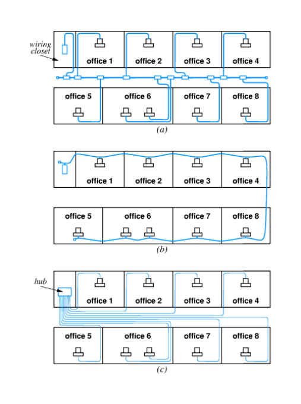

## 第四讲：物理层协议与传输介质

### 通信交换方式

通信线路连接方式

- 点 - 点方式：无需交换设备
- 多点方式：多个节点共用数据

- 在多节点通信网络中，为有效利用通信设备和线路，一般希望动态地设定通信双方间的线路。
- **动态地接通或断开通讯路径，称为“交换”**
- 交换方式分类
  - 电路交换
  - 报文交换——存储转发方式
  - 分组交换（包交换）——存储转发方式
  - 混合交换

电路交换：

- 原理：直接利用可切换的物理通信线路，连接通信双方
- 三个阶段：
  - 建立电路
  - 传输数据
  - 拆除电路
- 特点
  - 在发送数据前，必须建立起点到点的物理通路
  - 建立物理通路时间较长，数据传送延迟较短（独占通信信道）
- 例：电话网
- 电路交换设备：incoming links -> Node -> outgoing links

报文交换：

- 原理：信息以报文（逻辑上完整的信息段）为单位进行存储转发
- 特点
  - 不要求发送与接受双方同时可用
  - 可以实现一对多的传输
  - 可以实现报文优先级传输
  - 可以在中间节点进行差错校验与纠错处理
  - 不拒绝服务
  - 要求中间结点（网络通信设备）缓冲大
  - 线路利用率高
  - 延迟时间长
- 报文交换：incoming links -> Node(Memory) -> outgoing links

分组交换(packet switching)：

- 原理
  - **信息以分组为单位进行数据存储和转发。**源结点把报文分为分组，在中间结点进存储转发，目的结点把分组合成报文
  - 分组：比报文还小的信息段，可定长，也可变长
- 特点
  - 每个分组头包括目的地址，独立进行路由选择
  - 线路利用率高
  - 结点存储器利用率高
  - **易于重传，可靠性高**
  - 易于开始新的传输，让紧急信息优先通过
  - *额外信息增加*

- 虚电路
  - 电路交换和分组交换的结合
  - 三个阶段
    - 建立：发带有全称网络地址的呼叫分组，建立虚电路
    - 传输：沿建立好的虚电路传输数据
    - 拆除：拆除虚电路

- 电路交换适用于实时信息和模拟信号传送，在线路带宽比较低的情况下使用比较经济
- 报文交换适用于线路带宽比较高的情况，可靠灵活，但延迟大
- 分组交换缩短了延迟，也能满足一般的实时信息传送。在高带宽的通信中更为经济、合理、可靠。是目前公认较好的一种交换技术

### 物理层简介

- 物理层的功能：在两个网络设备之间提供**透明**的**比特流**传输
- 物理层的任务：物理连接的启动和关闭，正常数据的传输，以及维护管理
- 物理层的定义 ISO/OSI
  - 提供**机械的、电气的、功能的和规程的特性**
  - 目的是启动、维护和关闭数据链路实体之间进行**比特传输的物理连接**

#### 物理层的特性 - 实例 1

- 机械特性
  - 主要定义物理连接的边界点，即接插装置。规定物理连接所采用的<u>规格、引脚的数量和排列情况</u>
  - 常用的标准接口
    - EIA RS-232-C, EIA RS-366-A...
- 电气特性
  - 规定传输二进制位时，线路上信号的<u>电压高低、阻抗匹配、传输速率和距离限制</u>
  - CCITT 标准化的电气特性标准
    - EIA RS-232-C 非平衡型电气特性，公用的地线：逻辑 1 为 -15V ~ -5V，逻辑 0 为 +5V ~ +15V
    - EIA RS-449
    - EIA RS-422-A 新的平衡型电气特性，无公用的地线：<u>+</u> 6 (<u>+</u> 2) V
- 功能特性
  - 主要定义各条物理线路的功能
  - 线路的功能分为四大类
    - 数据
    - 控制
    - 定时
    - 电源、地
- 规程特性
  - 主要定义各条物理线路的工作规程和时序关系
  - RS-232-C 的规程为：
    - 第四 (7) 根针置位，请求发送 ->
    - 第五 (8) 根针置位，允许发送 ->
    - 数据通过第二 (3) 根针发送

#### 物理层的特性 - 实例 2

- 机械特性
  - 主要定义物理连接的边界点，即接插装置。规定物理连接时所采用的规格、引脚的数量和排列情况。
  - 常用的标准接口
    - RJ45, TIA/EIA-568-A, TIA/EIA-568-B
- 电气特性
  - 规定传输二进制位时，线路上信号的电压高低、阻抗匹配、传输速率和距离限制。
  - 电气特性实例
    - 电平水平 -3V
    - 直流电阻 -19 欧姆
    - 特性阻抗 -100 欧姆、120 欧姆及 150 欧姆
    - 接触电阻为 2.5mΩ
    - 绝缘电阻为 1000MΩ
    - 抗电强度为 DC1000V(AC700V0)
- 功能特性
  - 主要定义各条物理线路的功能
- 规程特性
  - 主要定义各条物理线路的工作规程和时序关系

### 通信传输媒介

- 信道:以传输介质为基础的信号通路，它是传输数据的物理基础。
- 有线传输介质： 包括双绞线、同轴电缆和光纤等。
- 无线传输介质： 包括无线电、微波、卫星、移动通信等各种通信介质。

---

### 小结

#### 选择传输介质

- 有介质连接
  - 铜缆技术成熟，价格便宜但最大传输率受限
  - 光纤：
    - 速度高
    - 抗干扰
    - 传输距离远
    - 只需要单根
    - 维护不方便
- 无介质连接
  - 无线与微波不需要物理连接
  - 无线与红外是便携式设备的理想选择
  - 激光不需要物理连接，但受气候影响大

#### 如何选择传输介质？

- 主要指标
  - 传输速率要求
  - 传输距离要求
  - 成本要求
    - 初始设备成本
    - 运营成本
  - 限制条件
    - 有线、无线
  - 可靠性要求
  - 扩展性要求

## 第五讲：局域网 Local Area Network(LAN)

直接点对点通信:

- 优点
  - 独占线路，传输效率高
  - 可以选择通信的细节
  - 安全性高
- 缺点
  - 连接的数量平方增长

$$
直接的连接数量 = C_N^2 = \cfrac{N\cdot(N-1)}{2}
$$

- 共享通信通道
  - 优点:降低费用
  - 缺点:内部协调与管理复杂

- 局域网
  - 将**特定区域内**的各种数据通信设备连接在一起的通信网络
  - 共享技术，**访问的局部性原理**

> 局域网并非地理概念，而是指是否共享通讯介质

### IEEE 802 模型

- 1980年2月国际电子与电气工程师协会发布802规范，强化OSI模型
- 局域网体系结构由物理层、介质访问控制子层（MAC-Media Access Control）
和逻辑链路控制子层LLC(Logical Link Control)组成

> 在 IEEE 802 模型中，讲主机至网络层分成了三个子层：物理层，MAC 子层，LLC 子层

- 物理层
  - 确保二进制位信号正确传输，位流的正确传送与接收。标准规范
  - 局域网传输介质与拓扑结构
  - 物理接口的机械特性、电气特性、功能特性和规程特性
  - 传输信号的编码方案。局域网常用的编码方案有：曼彻斯特码、差分曼彻斯特码、非归零码、4B/5B 码、8B/6T 和 8B/10B 等。
  - 错误校验码以及同步信号的产生与删除
- MAC 子层（介质访问控制）
  - MAC 是数据链路层的一个功能子层。MAC 直接与物理层相邻。
  - 合理的信道分配，解决信道竞争问题。完成介质访问控制功能，为竞争的用户分配信道使用权，并具有管理多链路的功能。
  - MAC 子层为不同的物理介质定义了介质访问控制标准。IEEE 802 的介质访问控制标准有 CSMA/CD、TokenRing、Token-Bus 等。
- LLC 子层（逻辑链路控制）
  - LLC 子层的功能包括： 数据帧的组装与拆卸、帧的收发、差错控制、数据流控制和发送顺序控制等功能并为网络层提供：面向连接服务和无连接服务。
  - LLC 在 MAC 子层的支持下向网络层提供服务。可运行于所有 802 局域网和城域网协议之上的数据链路协议。
  - LLC 子层与传输介质无关，它独立于介质访问控制方法，隐藏了各种 802 网络之间的差别，向网络层提供一个统一的格式和接口。

### 拓扑与布线

#### 局域网基本拓扑结构

- **星形拓扑**
  - 所有计算机连接在一个中心节点上
  - 各自独占通信信道
- **环状拓扑**
- 计算机连接在一个封闭的环内
- **总线拓扑**
  - 计算机以共享电缆连接，共享信道（无中心节点，多用于以太网）
- 树形
  - 分层结构
- 网状（自由度最大）
  - 结点之间任意联结
  - 连接多个子网或多个局域网

#### 局域网典型布线方案（IEEE 802.3）

- 以太网布线方案一（总线拓扑）
  - 粗缆以太网
    - 网卡
    - 连接单元接口（AUI Attachment Unit Interface）
    - 终结器（相当于电阻，用于**防反射**）
  - 工程特性（10M bps IEEE 标准：10Base-5）
    - 最短收发器间距：2.5 米
    - 每网段最多计算机数：100
    - 最大传输距离：500 米
    - 最大网络长度：2500 米
    - 通过**多用复用器**来扩展计算机数和网络长度（多台计算机共用一个节点）
- 以太网布线方案之二（总线拓扑）
  - 细缆以太网：只用实现电路连接，不再需要连接单元接口，性价比更高
    - 同轴电缆（屏蔽干扰）
    - 安装与运行费用低
    - 使用BNC连接器
    - **不需要外部收发器**
    - 终结器
    - 工程特性（10M bps IEEE 标准：10Base-2）
      - 典型缆线：细缆
      - 最大传输距离：185 米
      - 最短传输距离：0.5 米
      - 每网段最多计算机数：30 台
      - 最大网络长度：925 米
- 以太网布线方案之三（星形拓扑，*总线拓扑*）
  - 双绞线以太网：目前应用最多
    - 也叫 TP 以太网，正式称 10Base-T
    - RJ-45 连接器
    - 集线器 (Hub)
    - 工程特性（10M bps IEEE 标准：10Base-T）
      - 典型缆线：UTP3、4、5 类
      - 连接器：RJ-45
      - 最大传输距离：100 米
      - 最短传输距离：2.5 米



- 三种布线方案的比较
  - 收发器安装、维护困难
  - 细缆容易破坏
  - 价格

- 10Base-T 的优点
  - 网络扩展方便
  - 线路安装与电话可以同步，节省费用
  - 网络建立灵活、方便
  - 故障定位方便、排除简单
  - 系统整体费用低

### 介质访问控制 MAC

- 总线拓扑实例
  - Ethernet
    - 载波侦听多路访问
    - 冲突检测
    - CSMA/CD (Carrier Sense Multiple Access with Collision Detection)
    - 截断二进制指数重发

$$
T=2\tau\times(2^i-1), i\ 为回退次数，\tau\ 为时间常数
$$

```mermaid

```

- 载波侦听过程：查是否已经有结点利用总线在发送数据
- 冲突检测：比较法和编码违例判决法

### IEEE 802.11 无线 LAN

- 无线 LANs: 不拘范围 (经常是移动的) 联网形态
- IEEE 802.11 标准:
- MAC 协议
  - 无需注册的频率范围：2.4GHz（14 信道），5GHz 更多信道，ISM

#### 802.11 MAC层: CSMA/CA

- 802.11 CSMA: 发送方
  - 如果检测到信道闲置了 DIFS 秒.
  - 然后传输整个帧(无冲突)
  - 如果检测到信道忙，然后进行二进制避退（binary bakeoff）
- 802.11 CSMA 接收方
- 如果接收 OK，等待 SIFS 后返回 ACK

#### 冲突避免: RTS-CTS 交换

- CSMA/CA: 进行显式的信道预留
  - 发送方: 发送简短的 RTS: request to send
  - 接收方：使用简短的 CTS: clear to send 回应
- CTS 为发送方预留了信道，并通知了其他 (可能是隐蔽的) 站点
- 避免了隐蔽站点的冲突

### 局域网基本拓扑结构实例 802.5

环状拓扑实例：令牌环网（无冲突，依靠介电来通讯）

环状拓扑实例：

- FDDI (Fiber Distributed Data Interconnection)

### 数据帧

`soh` + 帧数据 + `eot`

- 帧(frame)-MAC
  - 帧的格式
  - 保证传输质量（头与尾）
  - 字节填充（长度控制）
  - 传输差错与奇偶校验
-包(packet)的使用-IP
  - 发送与接收方协调
  - 公平占用资源原则

#### 硬件编码

- 帧的识别与接收
  - 物理地址
    - 共享网络
    - 检测每一帧
    - 获取副本
    - 物理地址特性
      - 静态的
      - 可配置的
      - 动态的
      - 广播地址

- 前导码与帧前定界符字段
  - 前导码：7个字节，10101010…101010
  - 帧前定界符：1字节，10101011
- 目的地址和源地址字段
  - 地址字段长度：2 个字段，各 6 个字节
- 帧类型字段
  - 2 个字节，表征帧数据的类型。IP or ARP frame?
- 数据字段
  - LLC 数据字段是帧的数据字段，长度最小为 46 个字节，少于 46 个字节，需要填充
- 帧校验字段
  - 采用 32 位的 CRC 循环冗余校验
  - 校验的范围是：目的地址、源地址、类型、数据字段
- 帧长度
  - 帧的最小长度为 64 字节，最大长度为 1518 字节

#### 局域网布线、接口与物理结构

- 计算机中的网络接口
  - 网络适配器
  - 网线及接口插件（RJ-45）
  - Win XP 硬件管理（P & P）

##### 网卡

- 网络接口板又称为通信适配器(adapter)或网络接口卡 NIC(Network Interface Card) 。
- 网卡和计算机之间的通信则是通过计算机主板上的 I/O 总线以并行传输方式进行的。
- 当网卡收到一个有差错的帧时，它就丢弃此帧而不必通知它所插入的计算机。
- 当网卡收到一个正确的帧时，使用中断来通知该计算机主 CPU 并交付给网络层。
- 当计算机要发送一个 IP 数据报时，就由协议栈向下交给网卡组装成帧后发送到局域网。

##### Ethernet 实现方法

##### 以太网 Ethernet 特点

- 以太网是基带网，它采用基带传输技术。
- 以太网的标准是 IEEE802.3，它使用 CSMA/CD 访问方法。
- 以太网是一种共享型网络，网络上的所有站点共享传输媒质和带宽。当利用率到达 40% 时，网络的响应速度明显降低。
- 以太网是广播式网络，因此，它具有广播式网络的全部特点。
- 以太网支持传输介质类型有 50Ω 基带同轴电缆、无屏蔽双绞线和光纤。
- 以太网所构成的拓扑结构主要是总线型和星型。
- 多种以太网标准，传输速率：10Mb/s、100Mb/s、1000Mb/s。
- 以太网技术先进，又很简单，这是它获得成功的主要原因。
- 以太网技术成熟，价格低廉、易扩展、易维护、易管理。
- 以太网是可变长帧，长度为：64bytes-1518bytes。
