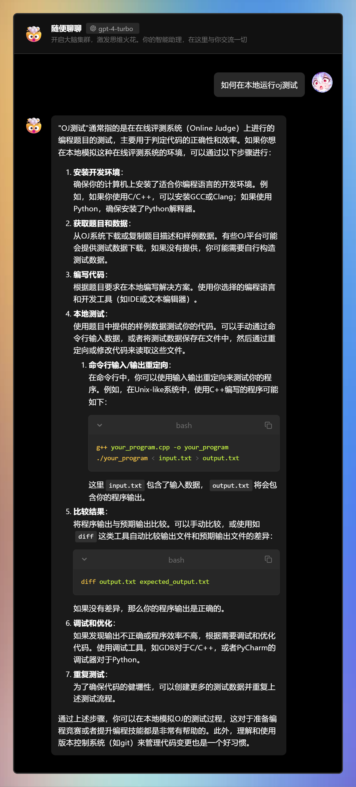

# HW02

## T1: Wrong Number

思路：读懂代码含义后按照自己的理解稍微重构了一下

主要改动：

- 为 flag 提供初值，默认为真
- 修复并统一了 digit 的判断，用函数替代
- 修复了内层字符子串的索引和输出

次要改动：代码风格（由 ide 自动完成）与注释

- 调整了一下变量命名
- 移除了 `using namespace std`
- 修改了一下注释

提交的代码如下：

```cpp
#include <cctype>
#include <iostream>
#include <string>

inline bool isDigit(char c) { return c >= '0' && c <= '9'; }

int main() {
  // iterate over each line of input
  for (std::string str; getline(std::cin, str);) {
    // flag: is the first integer of the current line, default to true
    bool isFirstInt{true};
    size_t strLength = str.size();

    for (size_t i = 0; i < strLength; i++)
      if (isDigit(str[i])) { // str[i] is a digit
        size_t r = i + 1;
        while (isDigit(str[r]))
          ++r; // now str[r - 1] is a digit, str[r] is not a digit

        // use the flag
        if (isFirstInt)
          isFirstInt = false;
        else
          putchar(' ');

        for (size_t j = i; j < r; j++)
          putchar(str[j]);

        i = r; // skip the current integer
      };
    putchar('\n');
  }
  return 0;
}
```

## T2: Wrong Drink

思路：从原始的代码的输出可知存在内存泄漏的问题，首先全部改用成智能指针，之后的改动主要是完成未实现的部分，最后优化一下细节

主要改动：

- 全部改用智能指针实现链表
- 修复了循环中的逻辑
- 添加了在无法混酒时输出 -1 的逻辑
- 在算斜率时添加了除零检查
- 输出时加上了换行符

次要改动：代码风格（由 ide 自动完成）与注释

- 移除了 `using namespace std`
- 移除了未使用的头文件
- 移除了未使用的代码

提交的代码如下：

```cpp
#include <algorithm>
#include <iostream>
#include <memory>
#include <vector>

typedef std::pair<int, int> dpair;

struct Wine {
  /**
   * @param d 浓度
   * @param p 价格
   */
  int d, p;
  std::unique_ptr<Wine> last;

  static int counter;
  Wine() { ++counter; }
  ~Wine() { --counter; }
};

int Wine::counter = 0;

// 内存检查器, 请勿修改
struct Checker {
  int _;
  ~Checker() {
    if (Wine::counter != 0) {
      std::cout << "你的对象没有正确释放!\n";
    }
  }
} _c;

int main() {
  int n, m;
  std::vector<dpair> wines;
  scanf("%d%d", &n, &m);
  for (int i = 0; i < n; i++) {
    int d, p;
    scanf("%d%d", &d, &p);
    wines.push_back(dpair(d, p));
  }
  // 按照浓度排序
  // ? 根据题目描述，应该不存在两个浓度相同但价格不同的酒
  sort(wines.begin(), wines.end());

  std::unique_ptr<Wine> d; // 链表头节点
  for (int i = 0; i < n; i++) {
    // compiler require >= c++14
    auto q = std::make_unique<Wine>();
    q->d = wines[i].first;
    q->p = wines[i].second;
    while (d != nullptr && d->last != nullptr) {
      // 排除浓度相同的酒
      if (q->d == d->d || q->d == d->last->d)
        break;

      // 若在最后两点连线下方, 则替换掉最后一个点
      if ((q->p - d->p) / (q->d - d->d) <=
          (d->p - d->last->p) / (d->d - d->last->d)) {
        d = std::move(d->last);
      } else {
        break;
      }
    }

    if (!d || q->d != d->d) {
      q->last = std::move(d);
      d = std::move(q);
    }
  }

  // 将链表转换回数组以便二分查找
  wines.clear();
  for (auto i = std::move(d); i != nullptr;) {
    wines.push_back(dpair(i->d, i->p));
    i = std::move(i->last);
  }
  reverse(wines.begin(), wines.end());

  for (int i = 0; i < m; i++) {
    int q;
    scanf("%d", &q);
    // 若 q 小于最小浓度, 则无法购买
    if (q < wines.front().first || q > wines.back().first) {
      printf("-1\n");
      continue;
    }
    // 二分查找 q 所在的线段
    auto it = lower_bound(wines.begin(), wines.end(), dpair(q, 0));
    auto ib = it - 1;
    double res = (it->first - q) / (double)(it->first - ib->first) * ib->second;
    res += (q - ib->first) / (double)(it->first - ib->first) * it->second;
    printf("%.2lf\n", res);
  }

  return 0;
}
```

## T3: 银行账户异常处理

思路：此题基本是完型填空，根据上下文即可推断填入的内容

主要改动：补全宏定义

次要改动：代码风格（由 ide 自动完成）

- 移除了未使用的头文件

提交的代码如下：

```cpp
#include <algorithm>
#include <iostream>
#include <memory>
#include <vector>

typedef std::pair<int, int> dpair;

struct Wine {
  /**
   * @param d 浓度
   * @param p 价格
   */
  int d, p;
  std::unique_ptr<Wine> last;

  static int counter;
  Wine() { ++counter; }
  ~Wine() { --counter; }
};

int Wine::counter = 0;

// 内存检查器, 请勿修改
struct Checker {
  int _;
  ~Checker() {
    if (Wine::counter != 0) {
      std::cout << "你的对象没有正确释放!\n";
    }
  }
} _c;

int main() {
  int n, m;
  std::vector<dpair> wines;
  scanf("%d%d", &n, &m);
  for (int i = 0; i < n; i++) {
    int d, p;
    scanf("%d%d", &d, &p);
    wines.push_back(dpair(d, p));
  }
  // 按照浓度排序
  // ? 根据题目描述，应该不存在两个浓度相同但价格不同的酒
  sort(wines.begin(), wines.end());

  std::unique_ptr<Wine> d; // 链表头节点
  for (int i = 0; i < n; i++) {
    // compiler require >= c++14
    auto q = std::make_unique<Wine>();
    q->d = wines[i].first;
    q->p = wines[i].second;
    while (d != nullptr && d->last != nullptr) {
      // 排除浓度相同的酒
      if (q->d == d->d || q->d == d->last->d)
        break;

      // 若在最后两点连线下方, 则替换掉最后一个点
      if ((q->p - d->p) / (q->d - d->d) <=
          (d->p - d->last->p) / (d->d - d->last->d)) {
        // d = d->last;
        d = std::move(d->last);
      } else {
        break;
      }
    }

    if (!d || q->d != d->d) {
      q->last = std::move(d);
      d = std::move(q);
    }
  }

  // 将链表转换回数组以便二分查找
  wines.clear();
  for (auto i = std::move(d); i != nullptr;) {
    wines.push_back(dpair(i->d, i->p));
    i = std::move(i->last);
  }
  reverse(wines.begin(), wines.end());

  for (int i = 0; i < m; i++) {
    int q;
    scanf("%d", &q);
    // 若 q 小于最小浓度或大于最大浓度, 则输出 -1
    if (q < wines.front().first || q > wines.back().first) {
      printf("-1\n");
      continue;
    }
    // 二分查找 q 所在的线段
    auto it = lower_bound(wines.begin(), wines.end(), dpair(q, 0));
    auto ib = it - 1;
    double res = (it->first - q) / (double)(it->first - ib->first) * ib->second;
    res += (q - ib->first) / (double)(it->first - ib->first) * it->second;
    printf("%.2lf\n", res);
  }

  return 0;
}
```

## 其他

在 windows 上使用的开发环境是 llvm 三件套 + vscode，debug 用了 powershell 作为终端，输出时只检查了结果而没考虑 `printf` 断行问题，导致在提交时一直查不出具体失败原因，且由于提供测试集较大，不便于直接粘贴，通过询问 GPT 了解到了命令行输入重定向的方式来进行本地测试，由于 `<` 重定向输入只能在 linux 环境进行，T2 后续调试换用 linux，使用的开发环境是 gcc + neovim，使用的命令行如下：

```bash
g++ -g ./t2.cpp -o2 -o ./t2 -std=c++14
./t2 < ./data/t2/1.in > 1.out
diff ./1.out ./data/t2/1.ans
```

第一次运行提供的测试时报出了 `floating point exception (core dumped)`，经查询可能是除零错误，考虑道对浓度的规范不完全，于是添加了除零检查，后续调试中意识到是末尾换行符的问题，添加后即可通过 oj。

参考资料：

- https://hatchjs.com/floating-point-exception-core-dumped/

ai 对话历史：


