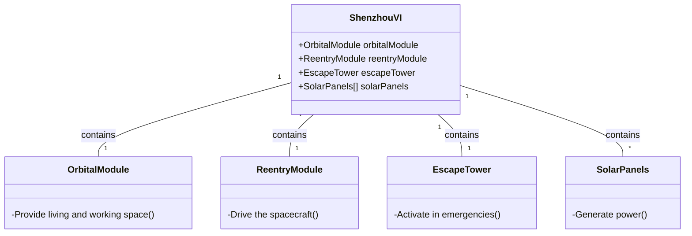

```mermaid
classDiagram
    class ShenzhouVI {
        +OrbitalModule orbitalModule
        +ReentryModule reentryModule
        +EscapeTower escapeTower
        +SolarPanels[] solarPanels
    }
    class OrbitalModule {
        -Provide living and working space()
    }
    class ReentryModule {
        -Drive the spacecraft()
    }
    class EscapeTower {
        -Activate in emergencies()
    }
    class SolarPanels {
        -Generate power()
    }

    ShenzhouVI "1" -- "1" OrbitalModule : contains
    ShenzhouVI "1" -- "1" ReentryModule : contains
    ShenzhouVI "1" -- "1" EscapeTower : contains
    ShenzhouVI "1" -- "*" SolarPanels : contains
```

