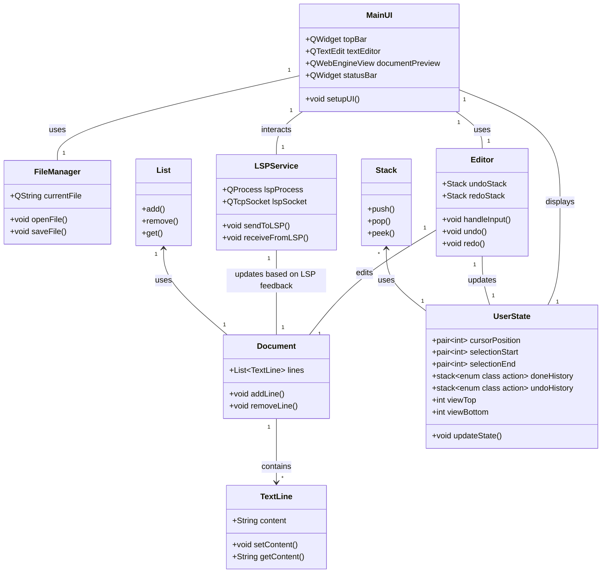
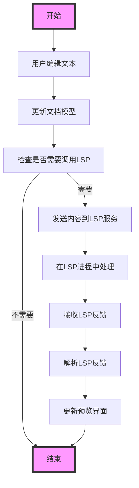

## 选题报告

刘宽 探微-分21 2022013189

大作业选题：基于 Qt 的 [Typst](https://typst.app) 编辑器 qode(名称暂定)。

### 需求分析

[Typst](https://github.com/typst/typst) 是一个新型的排版软件，基于 Rust 实现即时、增量的文档生成工具，同时也是一个新型的函数式编程语言。目前除了 Typst 的官方 webapp，vscode 插件外，独立实现的 Typst 的编辑器较少，根据我目前的调研情况来看，现在只有用 tauri + ts 实现的 [typster](https://github.com/wflixu/typster) 和 [Nole](https://github.com/FrostMiKu/Nole)，基于 Python 和 PyQt 的 [typstwriter](https://github.com/Bzero/typstwriter) 以及基于 c++ 和 Qt 的 [katvan](https://github.com/IgKh/katvan)，此外的个别项目如 [Typstify](https://github.com/iXORTech/Typstify)（适用于 iPad）、[BeauTyXT](https://github.com/soupslurpr/BeauTyXT)（适用于 Android） 等未列出。需要特别指出的是，上述提到的所有 Typst 编辑器均处于开发阶段（WIP），github 上相关 star 数最多的 [BeauTyXT](https://github.com/soupslurpr/BeauTyXT)为 103 stars（2024/11/18），其余在几十到个位数不等，对比现有的 Markdown 编辑器，可以认为 Typst 编辑器的实现案例稀少，具有明确的实用价值和现实需求。同时，经过了一年多的 Typst 使用实践，我认为 Typst 对比传统排版软件 Latex 具有明显的竞争优势，因而，参考了此次的选题建议后，我决定实现一个基于 Qt 的 Typst 编辑器。

### 概要设计

UI 部分使用 Qt6 实现，核心的编辑器功能（文本操作、文档操作）独立实现，语法高亮、语言服务（LSP）等实现中间层协议，向外提供接口（语法高亮通过 [tmLanguage](https://macromates.com/manual/en/language_grammars) 实现，LSP 使用 [Tinymist](https://github.com/Myriad-Dreamin/tinymist)）。

### 详细设计

#### 基础设施与工具链

环境配置：Nix

构建工具：qmake（Qt），xmake

包管理器：xrepo

UI 框架：Qt6

测试：qtest（Qt），utest.h

版本管理：git

第三方工具：Typst、Tinymist、Typstyle 等 Typst 侧工具及其他工具（如 doxygen，just 和 valgrind）

#### UI 设计

仿照 vscode，UI 采用 顶栏 + 主副窗口 + 底栏的设计。顶栏用于放置一些相关操作按钮（如保存等）；主窗口放置文本编辑器，用到 QTextEdit；副窗口预览当前文档，用到 QWebEngineView；底栏显示当前的文件状态和用户信息。

#### 核心功能设计

基本的文本操作和文档操作主要包括如下的一些功能，并用自己实现的 stl 库替代 cpp 的 stl 库：

- 打开和保存文件：主要是存储文件状态，用 Qt6 及 std 接口来处理文件系统。
- 编辑功能：用 Qt 的信号和槽机制来读取键盘鼠标输入并执行事件，编辑操作使用两个栈来管理。
- 文本数据管理：目前没有确定好具体的数据结构，打算是依行管理，行内使用数组（vector），行与行之间采用链表或树的结构，具体可能需要再研究一下目前已有的实践。
- 用户状态：涉及用户当前光标的聚焦点，所在行列数，选择区域，视窗状态，操作历史，以及快捷键、UI 层面的配置等，用一个全局的结构体来实现。
- 简单的 LSP 服务：Tinymist LSP 提供了语言服务和预览两个主要接口，设计预采用 QProcess 管理 LSP 进程，并用 QTcpSocket 与之通信，即把编辑器的内容发送到 LSP，再接收 LSP 输出变更状态，同时把 LSP 日志输出到 UI 界面，中间可能涉及一些消息处理等事件，会用到 json 的解析相关操作，预览部分使用 QWebEngineView。

#### 重难点分析

1. 进程管理

   启用 LSP 服务会同时启用两个进程，换言之在编辑器中需要启用三个进程，实现上依赖 Qt 的信号和槽机制，以及时序控制，这部分我没有在 cpp 和 Qt 实现的经历，需要参考一些例子来推进。

2. 交叉编译

   Typst 及其工具均使用 Rust 语言实现，而我使用的是 cpp 和 cpp 实现的 qt6，这其中不可避免需要把少量的 rust 部分和主要的 cpp 部分绑定起来，目前我对这一部分没有明确的头绪，已有的 cpp + qt6 绑定 rust 的工具 Rust Qt Binding Generator 已经缺乏维护，只能用于 qt5 和 qt4，一些活跃的工具则是 qt6 到 rust 的绑定，与我的目的想法相反，AI 给出的建议（也可能是唯一可行的方案）就是自己用 rust 提供 FFI 实现 cpp 对 typst 和 tinymist 的调用，再在 cpp 中调用相应的接口，由于我对 rust 和交叉编译不熟，因而这部分可能更多参考已有实践（如 katvan）。

3. 语言服务协议（LSP）实现

   由于目前 cpp 实现的编辑中能用 lsp 的较少，主流的 neovim，而且大型编译器并不便于学习，更多地会参考 lsp-cpp 等实现的 client 项目来更好地运用 lsp。

#### 与 katvan 的异同

从调研部分可以看到，qode（我） 与 katvan 均（预）使用 qt6 作为基本的框架，katvan 自身实现了一套 typst 的分析器和语法高亮，而 qode（我）打算把这一部分交给外部的配置 / Lsp 来实现，着重解决中间的协议和通信部分，原因一是能提高扩展性，同时把重要的语言服务交给更专业的 LSP（Tinymist） 实现，二是强调与 katvan 从零构建的不同（katvan 核心的语言服务大概有 ～7000 行代码）， 在有限的能力和时间下，我选择着重解决中间协议和通信的问题，以应用为主。

### 类图和流程图

> 此部分由 AI 总结，可能与实际设计由所出入。

文本编辑器与 LSP 服务间的通信流程图：

### 当前进度

已完成环境的配置，项目地址：<https://git.tsinghua.edu.cn/liukuan22/qode>

